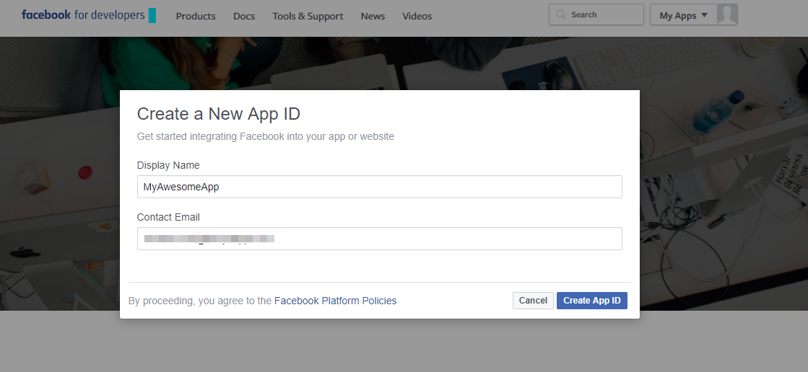
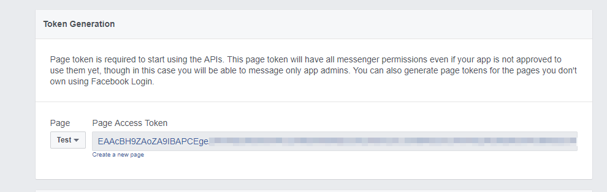
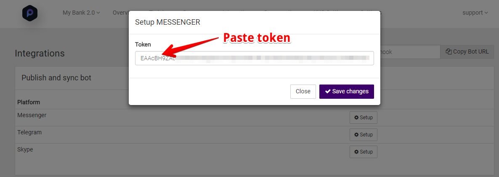
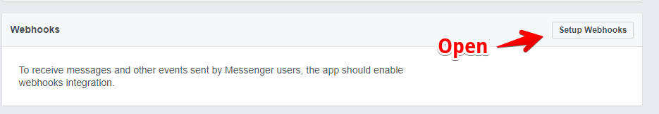
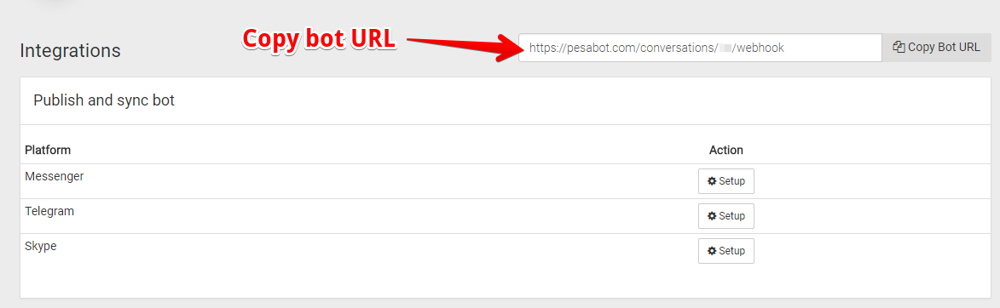
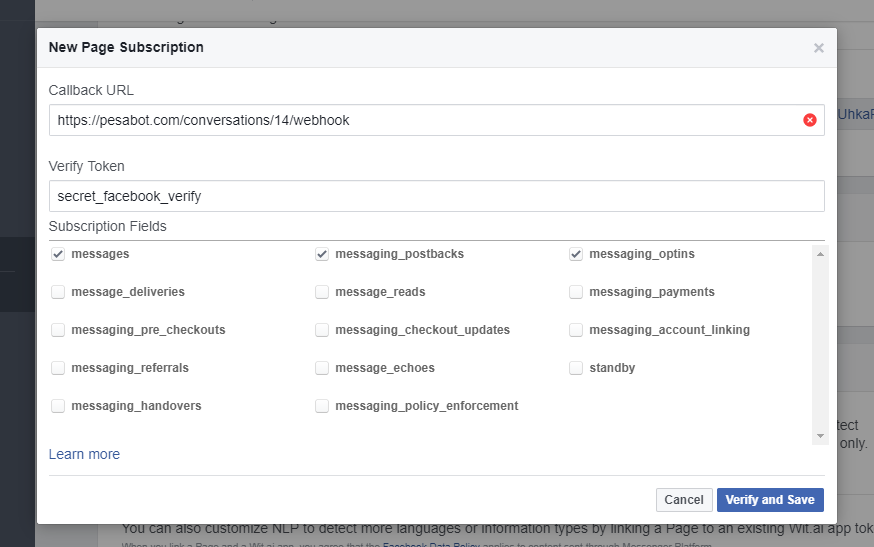
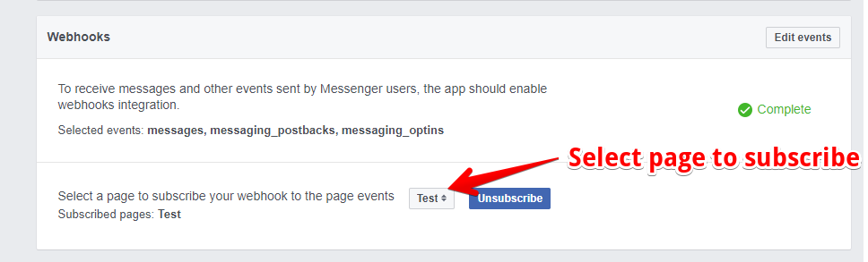
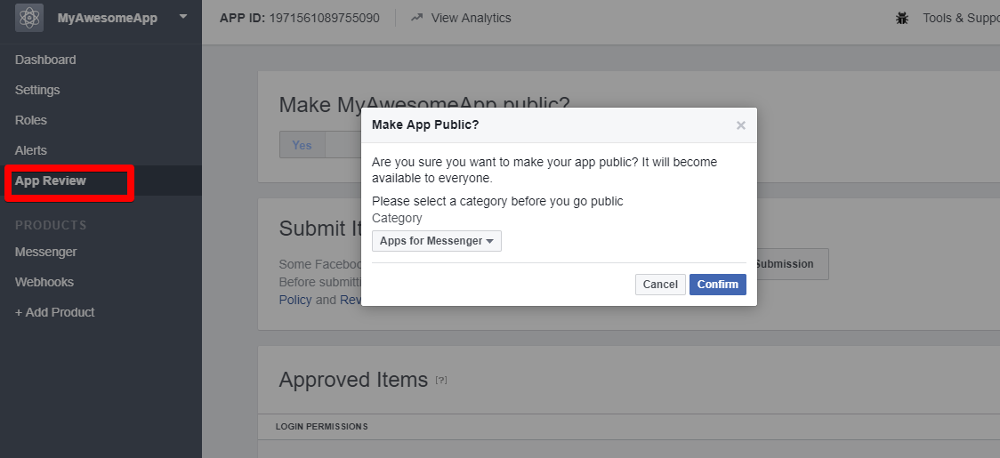

# Facebook Messenger
The PesaBot Facebook integration allows you to easily create a Facebook Messenger bot with natural language understanding, based on the PesaBot technology.

## Setting Up Facebook
In order to set up the Facebook integration for your agent, you'll need the following:

- Facebook account
- Facebook page to add your agent to
When a user visits your page and sends you a message, they'll be talking to your agent.

## Create a Facebook App
1. Log into the Facebook Developer Console.
2. Click on **My Apps** in the upper right hand corner.
3. Click on **Add a New App** and enter a name and contact email address
4. Click Create **App ID**. 

5. On the next page, click the **Get Started** button for the **Messenger** option.
6. Scroll on the open page to find **Token Generation** section, choose one of your Facebook pages.

This will generate a Page Access Token. Keep this token handy, as you'll need to enter it in PesaBot.

## Setting Up PesaBot
1. Click on the [Integrations](https://pesabot.com/integrations) option in the left menu and switch on 
Facebook Messenger. In the dialog that opens, enter the following information:
1. Token - Enter the token generated in the Facebook Developer Console and click save changes to continue.

## Setup Messenger Webhook
Finally we'll need to setup webhook for communication between PesaBot and messenger.

1.  Go back to **Messenger** and find the **Webhooks** section to begin.

2. Go to [Pesabot Integrations Page](http://pesabot.com/integrations/) to find the page url. Copy it for step 3 below.

3. Configure the Webhook dialog as:
    - Bot url goes under **Callback URL**
    - Use ***secret_facebook_verify*** for **Verify Token**
    - Under **Subscription Fields** select the following three options 
        - messages
        - messaging_postbacks
        - messaging_optins
    See image below for illustration.

    

4. Set your page subscription under the webhook section as show below.

 

## Testing your bot
In order to make your agent available for testing, you'll need to make your app public. To do this, click on **App Review** in the left menu for the **Facebook Developer Console**. Once there, click on the switch under Make **\<APP_NAME>** public? You'll be prompted to choose a category for your app. Choose **Apps for Messenger** from the list and click the Confirm button.

**Note:** You can make your app available for testing by adding testers to the app. To do this click on Roles in the left menu and then add people in the Testers section.