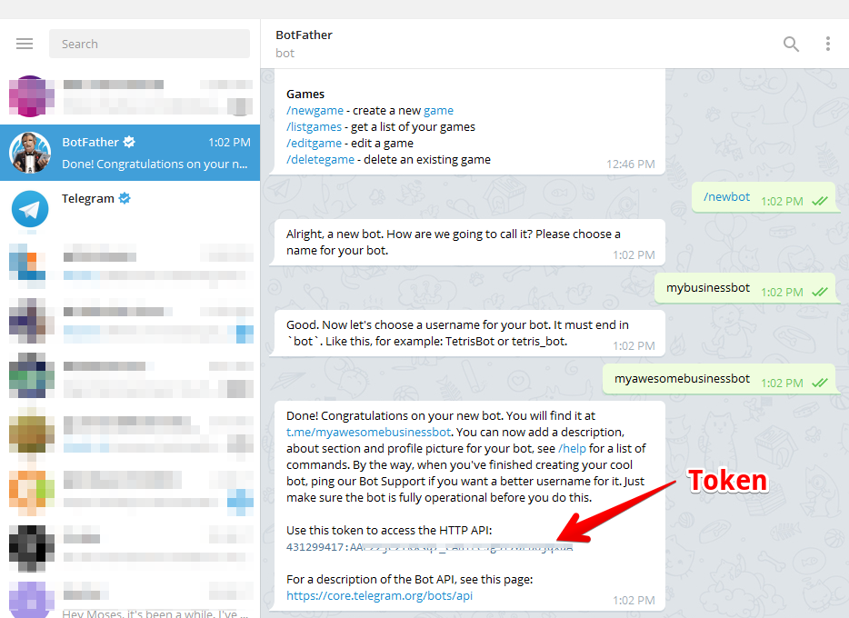
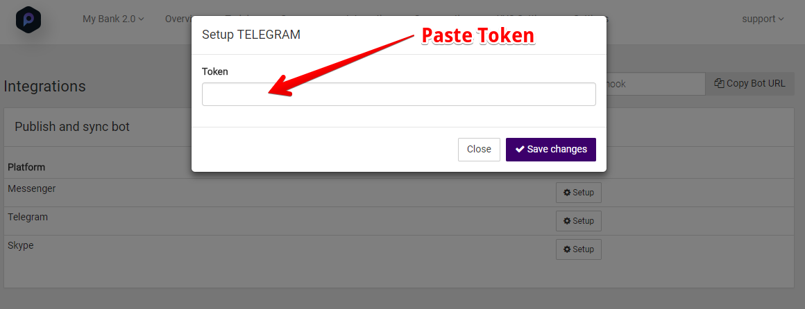
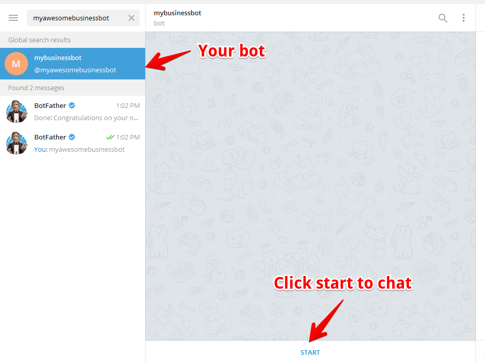

# Creating a new Telegram Bot

1. Log in [https://telegram.me/botfather](https://telegram.me/botfather) to create a new bot.
2. Click the Start button in the web interface or type /start
3. Click on or type /newbot and enter a name
4. Enter a username for the bot, ending in "bot" (e.g. mybusinessbot)
3. Copy the generated access token

# Setting up PesaBot 
1. Open the Telegram option under the [integration](https://pesabot.com/integrations) section
2. Paste the token copied earlier from Telegram and click save changes.

# Test your Bot
1. Go back to Telegram and search for the bot to begin chat.

